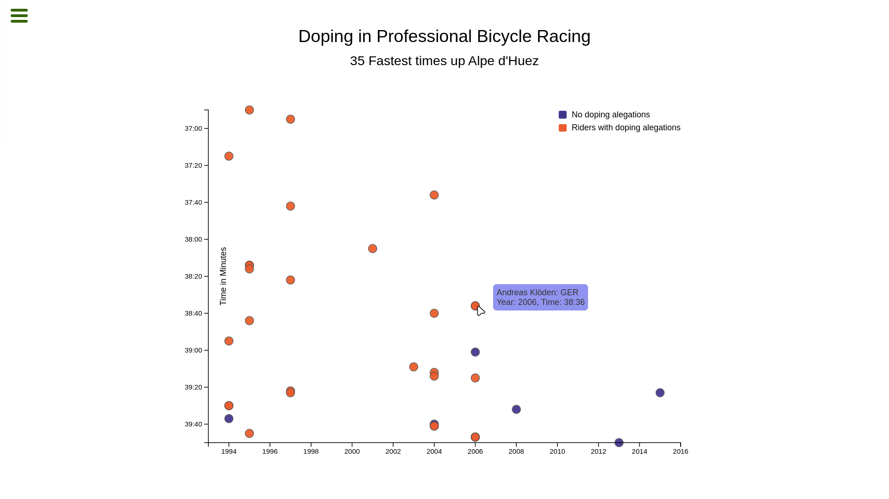

    
  <a href="https://github.com/mateus-sartorio/scatterplot-graph"><kbd>🔵 GitHub</kbd></a>

# FreeCodeCamp Scatterplot Graph Challenge

 

  

 

This project involves creating a scatterplot graph using D3.js, visualizing cyclist data from the provided JSON file. The graph displays various attributes, including year and race times, with interactive tooltips that provide detailed information upon hovering over each data point. The challenge emphasizes data visualization techniques, responsive design, and utilizing SVG elements effectively to present complex datasets clearly.

This project is part of the [Data Visualization certification](https://www.freecodecamp.org/learn/data-visualization) from freeCodeCamp and can be found [here](https://www.freecodecamp.org/learn/data-visualization/data-visualization-projects/visualize-data-with-a-scatterplot-graph).